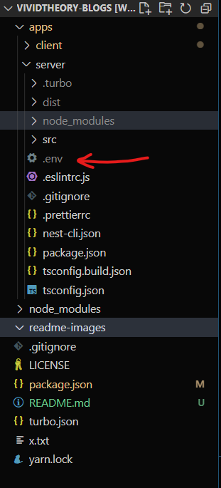

# Instructions to run project

## Node Version:

-   I used Node v19.5.0, but it should probably run on any 16+ node version

## Yarn:

-   Since I used Turborepo, it uses yarn workspaces so it's better to use yarn.
-   Install yarn with the following command if you don't have it

```
$ npm install --global yarn
```

## Clone Repo: Clone the repository or download the zip file and extract

```
$ git clone https://github.com/Pravasith/vividtheory-blogs.git
$ cd vividtheory-blogs
```

## Below are the steps to access the build version:

### Step 1: Install all dependencies

-   Since I used a TurboPack monorepo, you can install all deps by running -

```
$ yarn install
```

### Step 2: Copy the .env file (attached in the email, assignment upload)

-   Copy the .env file into the following location

```
apps/server
```



### Step 3: Start Backend server

#### !!! Important: You must start the Backend server first before starting frontend server

-   You should be in the root directory before you run the next command
-   Run the command -

```
$ yarn start:server
```

-   The backend now runs on http://localhost:8000/
-   Before you run the frontend, please open a new terminal and wait for the server to start

### Step 4: Start Frontend server in a new Terminal

#### Please ensure that you opened a new terminal to run the nest command

#### !!! Important: You must start the Backend server first before starting frontend server

-   You should be in the root directory before you run the next command
-   Run the command -

```
$ yarn start:client
```

### Step 5: View the app on a Web browser (Runs best on Chrome)

-   Navigate to http://localhost:3000/ to view the app!
-   FYI: The backend is running on http://localhost:8000/

## If you want to access the dev server:

### Step 1: Install all dependencies and copy the env file into server app

-   Follow Steps 1 and 2 from the build server instructions (above)

### Step 2: Run development server command

-   Navigate to root directory and run:

```
$ yarn dev
```

### Step 3: View the app on a Web browser (Runs best on Chrome)

-   Navigate to http://localhost:3000/ to view the app!
-   FYI: The backend is running on http://localhost:8000/
